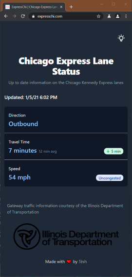
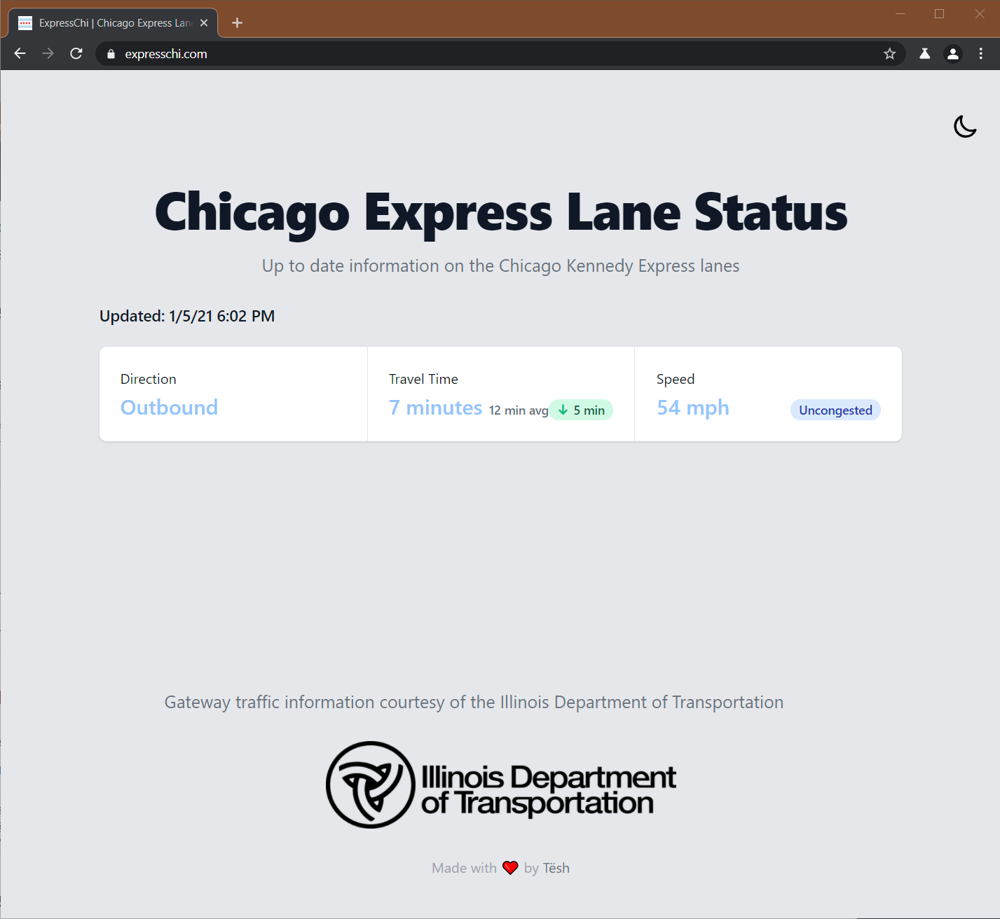

# Express Chi

A web app to view the status of the Chicago Kennedy express lanes.

## Getting Started

View App [Here](https://expresschi.com/)

  
  

## Built With

- [Typescript](https://www.typescriptlang.org/)
- [Next.js](https://nextjs.org/docs) - The React Framework.
- [Tailwind CSS](https://chakra-ui.com/) - a simple, modular and accessible component library.
- [Vercel](https://vercel.com/) - Vercel is the platform for frontend developers, providing the speed and reliability innovators need to create at the moment of inspiration.
- [IDOT](https://idot.illinois.gov/) - gateway traffic information courtesy of the Illinois Department of Transportation

## Authors

Alex Matseshe

## License

[MIT](LICENSE)
